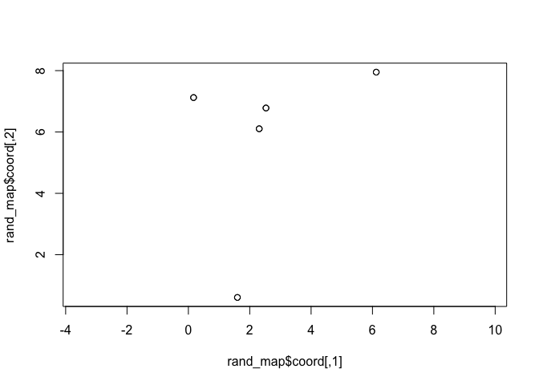

<!-- README.md is generated from README.Rmd. Please edit that file -->

# acsimdata

<!-- badges: start -->

<!-- badges: end -->

The goal of acsimdata is to create simulated data to allow reproducible
testing of antigenic cartography methods and quality measures.

## Installation

You can install the released version of acsimdata from Github with:

``` r
devtools::install_github("drserajames/acsimdata")
```

## Example

This is the basic usage:

``` r
library(acsimdata)

# Create random map and distances
rand_map <- map_maker_random(5,5,10, seed=327458)
plot(rand_map$coord, asp=1)
```



``` r

# Add random noise to the distances
noisy_dist <- add_noise(rand_map$dist)

# Convert the distances into titres like HI data
noisy_titres <- dist_to_hi_titre(noisy_dist$noise_dist_table)

# Remove titres to create missing data
miss_noisy_titres <- miss_titres_random(noisy_titres$lessthan_titre, proportion = 0.2)

# Output which can be used with the Racmacs package
miss_noisy_titres$rm_titre
#>     SR1     SR2    SR3    SR4    SR5    
#> AG1 "10240" "320"  "160"  "40"   "*"    
#> AG2 "80"    "5120" "5120" "2560" "320"  
#> AG3 "<10"   "1280" "1280" "320"  "320"  
#> AG4 "<10"   "*"    "*"    "5120" "20"   
#> AG5 "20"    "1280" "*"    "*"    "10240"
```
